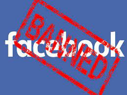

# facebook-ban-phrases
List of phrases in different languages for which you can get banned on Facebook

This project was born from the experience of active work on Facebook, when authors and friends received restrictions on posting content or were banned by this platform, its moderators and AI for seemingly completely harmless farases like "the cat needs to be spayed" or "I liked it, I'll steal it." The project aims to collect sufficiently large dictionaries of "dangerous" phrases for which you may be subject to restrictions.

In the future, based on the collected dictionaries, it is planned to create extensions for popular browsers with which you can check the "danger" of your texts before sending them to Facebook.

### Dictionary structure:

    \dict
	domains.txt
        Obscene lexic:
        \obscene
            \en-En.txt
            English dictionary
            \ru-RU.txt
            Russian dictionary
        Non-obscene lexic:
        \obscene
            \en-En.txt
            English dictionary
            \ru-RU.txt
            Russian dictionary

### The project welcomes to pull requests and discussions!

### Carefully 18+! The project contains obscene lexical!.

### Telegram contact: @bormaxi

### Telegram community (here you can offer options for what you were banned): https://t.me/facebook_ban_phrases

### ETH Donate: 0xE29685D6f0032Bccac08B0E745a1A69ef9803973

### A few links about why and how you can be banned:

https://www.alphr.com/get-around-facebook-ban/

https://alidropship.quora.com/Got-Banned-From-Facebook-Here-Are-The-Possible-Reasons-Why

https://leadzavod.com/19779-2/
